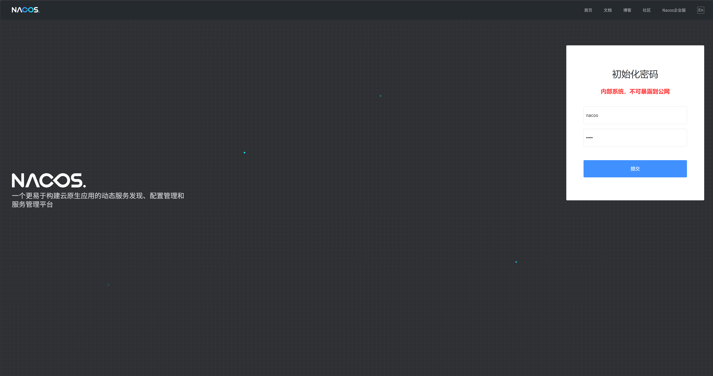

# nacos 使用准备

快速开始使用nacos单机版

[下载 nacos 2.x 稳定版本 2.5.1](https://nacos.io/download/nacos-server/?spm=5238cd80.72a042d5.0.0.5124cd36tHzAsq)

## 启动 nacos

进入到bin目录下，执行启动命令

```bash
startup.cmd -m standalone
```

启动成功后，访问 http://localhost:8848/nacos/index.html

默认未开启鉴权，使用内置数据库

## 使用MySQL数据库

1. 确保MySQL已安装并启动
2. 创建数据库 nacos-server
3. 初始化数据库，数据库初始化文件[mysql-schema.sql](https://github.com/alibaba/nacos/blob/master/distribution/conf/mysql-schema.sql?spm=5238cd80.72a042d5.0.0.5124cd36tHzAsq&file=mysql-schema.sql)
4. 修改配置文件，${nacos.home}/conf/application.properties

```properties
spring.sql.init.platform=mysql

### Count of DB:
db.num=1

### Connect URL of DB: 可以考虑创建一个专用用户
db.url.0=jdbc:mysql://127.0.0.1:3306/nacos-server?characterEncoding=utf8&connectTimeout=1000&socketTimeout=3000&autoReconnect=true&useUnicode=true&useSSL=false&serverTimezone=Asia/Shanghai
db.user.0=user
db.password.0=password
```

重启 nacos，访问 http://localhost:8848/nacos/index.html 在命名空间下新建一个命名空间，dev-server,创建成功后可以在数据库表`tenant_info`中看到新增了一条数据,说明MySql配置已经生效。

## 开启默认鉴权插件

目前直接访问 http://localhost:8848/nacos/index.html 访问成功，那是因为 nacos 2.x 中默认没有开启鉴权。
修改`conf`目录下的`application.properties`文件，修改配置：
```properties
### 开启访问鉴权，默认关闭
nacos.core.auth.enabled=true
### 用于生成JWT令牌的密钥(Base64 String):
nacos.core.auth.default.token.secret.key=$custom_base64_token_secret_key
### 配置自定义身份识别的key（不可为空）和value（不可为空）
nacos.core.auth.server.identity.key=nacos-agent
nacos.core.auth.server.identity.value=nacos-value
```

### 设置管理员密码
鉴权开关修改之后立马生效，无需重启服务。此时访问页面将会跳转到初始化密码页面


也可通过Admin API 接口，指定或随机生成管理员用户 `nacos` 的密码。
```bash
curl -X POST 'http://$nacos_server_host:$nacos_server_port/nacos/v1/auth/users/admin' -d 'password=$your_password'
```
若输入的密码为空字符串，或未带有password参数，Nacos将会生成随机密码并返回给用户。若指定或生成随机密码成功后，返回结果如下:
```json
{"username":"nacos", "password":"$your_password"}
```

